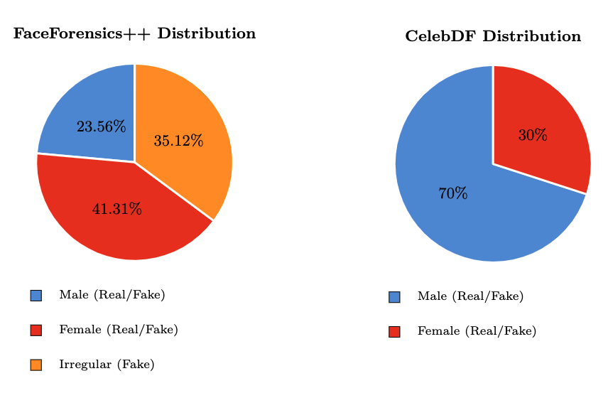
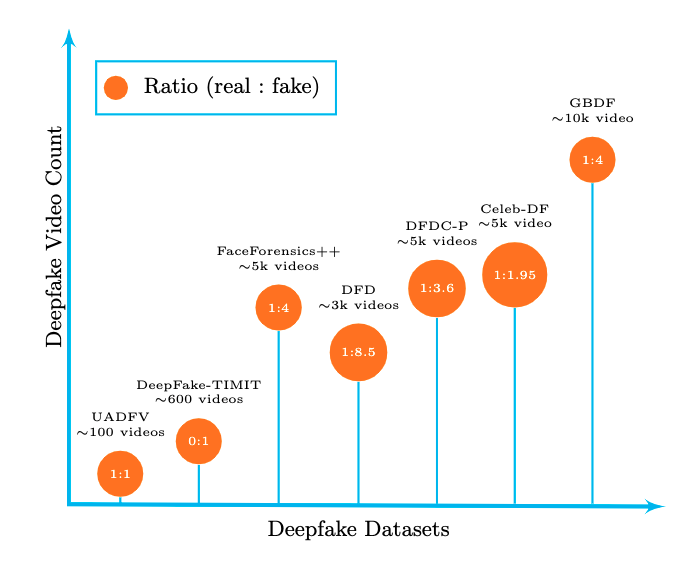

# GBDF: Gender Balanced DeepFake Dataset



A publicly available gender-balanced annotated deepfake dataset, GBDF, from FaceForensics++ (FF++), Celeb-DF, and Deeper Forensics-1.0 consisting of 10,000 live and fake videos generated using different identity and expression swapping deepfake generation techniques. The dataset consist of 10,000 videos with 5000 each for males and females with 1:4 real to fake ratio.
- [Research Paper]()
- [Download Data](https://github.com/aakash4305/GBDF)

Version 1.0 (07.17.2022)

## Table of Contents

- [Abstract](#abstract)
- [Database Properties](#database-properties)
- [Download](#download)
- [Citing](#citing)
- [Acknowledgment](#acknowledgment)
- [License](#license)


## Abstract

Facial forgery by deepfakes has raised severe societal con-
cerns. Several solutions have been proposed by the vision community
to effectively combat the misinformation on the internet via automated
deepfake detection systems. Recent studies have demonstrated that fa-
cial analysis-based deep learning models can discriminate based on pro-
tected attributes such as gender and race. For the commercial adoption
and massive roll-out of the deepfake detection technology, it is vital to
evaluate and understand the fairness (the absence of any prejudice or fa-
voritism) of deepfake detectors across demographic variations (protected
attributes). As the performance differential of deepfake detectors between
demographic sub-groups would impact millions of people of the deprived
sub-group. This paper aims to evaluate the fairness of the deepfake de-
tectors across males and females. However, existing deepfake datasets are
not annotated with demographic labels to facilitate fairness analysis. To
this aim, we manually annotated existing popular deepfake datasets with
gender labels and evaluated the performance differential of current deep-
fake detectors across gender. Our analysis on the gender-labeled version
of the datasets suggests (a) current deepfake datasets have skewed dis-
tribution across gender, and (b) commonly adopted deepfake detectors
obtain unequal performance across gender with mostly males outper-
forming females. Finally, we contributed a gender-balanced and anno-
tated deepfake dataset, GBDF, to mitigate the performance differential
and to promote research and development towards fairness-aware deep
fake detectors
For more details, please take a look at the [Research Paper]().

## Database Properties

The GBDF dataset is created using FF++(c23 version), Celeb-DF, DeeperForensics-1.0 and consist of 10,000 videos with 5000 each for males and females.As none of these existing deepfake datasets contain demographic information, we manually annotated ground truth gender labels for these datasets. The real/fake videos from these deepfakes datasets are merged to create GBDF dataset.Deepfakes in the GBDF dataset are created using different Identity Swapping
(i.e., FaceSwap, FaceSwap-Kowalski, FaceShifter, Encoder-decoder style and End-
to-end Face Swapping techniques) and Expression swapping (i.e., Face2Face and
NeuralTextures) deepfake generation techniques. The majority of the videos in
GBDF are from Caucasians. The ratio of real to fake videos in the GBDF dataset
is 1 : 4. The GBDF is further divided into gender-balanced and subject inde-
pendent training and testing subsets in the ratio of 70 : 30.





## Download

[GBDF](https://github.com/aakash4305/GBDF) provides gender annotations for deepfakes of the [FaceForesincs++](https://github.com/ondyari/FaceForensics) database,[Celeb-DF](https://github.com/yuezunli/celeb-deepfakeforensics) database,[Deeper Forensics-1.0](https://github.com/EndlessSora/DeeperForensics-1.0) database. 
- To get the **Deepfake dataset**, please visit the [FF++,celeb-DF,DeeperForensics-1.0] websites (https://github.com/ondyari/FaceForensics,https://github.com/yuezunli/celeb-deepfakeforensics,https://github.com/EndlessSora/DeeperForensics-1.0) and download the datasets.
- The **Gender annotations** of GBDF dataset are stored under [releases](). 
The annotations can be downloaded as xlsx file.
- The xlsx-file ("GBDF_training_labels.csv")  provides gender annotated version of the live and deepfake videos of 10,000 videos with 5000 each for males and females.
- The attribute file contain the gender annotations for the training of GBDF, in that order.


## Citing


If you use this work, please cite the following papers.


```
@inproceedings{roessler2019faceforensicspp,
	author = {Andreas R\"ossler and Davide Cozzolino and Luisa Verdoliva and Christian Riess and Justus Thies and Matthias Nie{\ss}ner},
	title = {Face{F}orensics++: Learning to Detect Manipulated Facial Images},
	booktitle= {International Conference on Computer Vision (ICCV)},
	year = {2019}
}


```

```
@inproceedings{jiang2020deeperforensics1,
  title={{DeeperForensics-1.0}: A Large-Scale Dataset for Real-World Face Forgery Detection},
  author={Jiang, Liming and Li, Ren and Wu, Wayne and Qian, Chen and Loy, Chen Change},
  booktitle={CVPR},
  year={2020}
}
```

```
@inproceedings{Celeb_DF_cvpr20,
   author = {Yuezun Li, Xin Yang, Pu Sun, Honggang Qi and Siwei Lyu},
   title = {Celeb-DF: A Large-scale Challenging Dataset for DeepFake Forensics},
   booktitle= {IEEE Conference on Computer Vision and Patten Recognition (CVPR)},
   year = {2020}
}
```
## Acknowledgment

This work is supported in part from National Science Foundation (NSF) award
no. 2129173. The research infrastructure used in this study is supported in part
from a grant no. 13106715 from the Defense University Research Instrumentation
Program (DURIP) from Air Force Office of Scientific Research.


## License

This project is licensed under the terms of the Attribution-ShareAlike 4.0 International ([CC BY-SA 4.0](https://creativecommons.org/licenses/by-sa/4.0/)) license.
All images used in this project belongs to the [FF++,celeb-DF,DeeperForensics-1.0](https://github.com/ondyari/FaceForensics,https://github.com/yuezunli/celeb-deepfakeforensics,https://github.com/EndlessSora/DeeperForensics-1.0). 
The copyright of the images remains with the original owners.
The copyright of the annotations remains with the VCBSL:Visual Computing and Biometric Security Lab, Wichita State University 2022.
